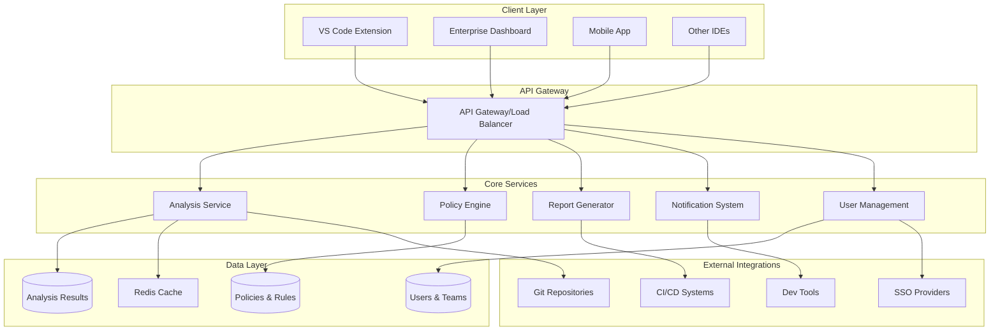
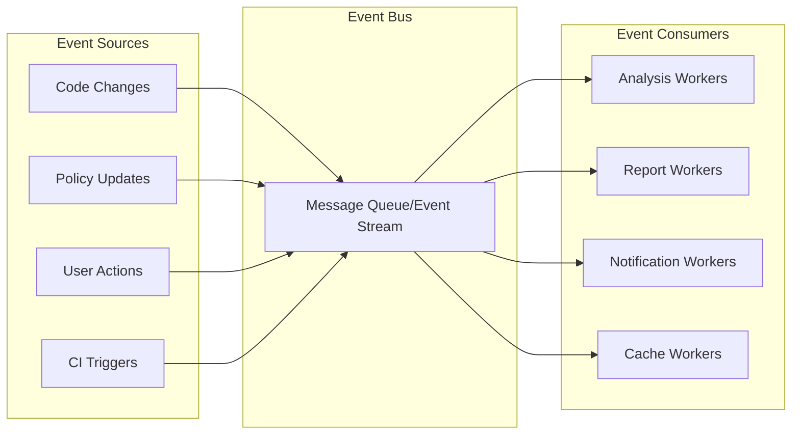

# Design Document

## Overview

CodeJanitor Enterprise transforms the existing VS Code extension into a comprehensive, scalable code quality platform for enterprise development teams. The design follows modern enterprise architecture patterns including microservices, event-driven architecture, and cloud-native principles to support large-scale deployments across distributed teams.

The platform consists of three main tiers:
1. **Analysis Engine** - Enhanced TypeScript/JavaScript analysis with parallel processing and intelligent caching
2. **Enterprise Platform** - Web-based dashboard, team collaboration, and policy management
3. **Integration Layer** - CI/CD pipelines, IDE plugins, and third-party tool integrations

## Architecture

### High-Level Architecture



### Event-Driven Architecture

The platform uses an event-driven architecture for scalability and loose coupling:



## Components and Interfaces

### 1. Enhanced Analysis Engine

**Core Analyzer Framework**
```typescript
interface EnterpriseAnalyzer extends IAnalyzer {
  readonly priority: number;
  readonly category: AnalyzerCategory;
  readonly supportedFrameworks: Framework[];
  
  analyzeWithContext(
    sourceFile: SourceFile, 
    config: AnalyzerConfig,
    context: AnalysisContext
  ): Promise<AnalysisResult>;
  
  getMetrics(sourceFile: SourceFile): QualityMetrics;
  validatePolicy(issue: CodeIssue, policy: Policy): PolicyViolation[];
}

interface AnalysisContext {
  workspaceInfo: WorkspaceInfo;
  gitContext: GitContext;
  dependencyGraph: DependencyGraph;
  previousResults: AnalysisResult[];
  teamPolicies: Policy[];
}

interface QualityMetrics {
  complexity: ComplexityMetrics;
  maintainability: MaintainabilityMetrics;
  security: SecurityMetrics;
  performance: PerformanceMetrics;
  testability: TestabilityMetrics;
}
```

**New Analyzers**
- **CircularDependencyAnalyzer**: Detects circular imports and suggests refactoring
- **ComplexityAnalyzer**: Calculates cyclomatic complexity and cognitive complexity
- **SecurityAnalyzer**: Identifies security vulnerabilities and patterns
- **AccessibilityAnalyzer**: Checks React/Vue components for accessibility issues
- **PerformanceAnalyzer**: Detects performance anti-patterns
- **DuplicationAnalyzer**: Finds duplicate code blocks across files
- **TestCoverageAnalyzer**: Identifies untested code paths

### 2. Enterprise Platform Services

**Policy Engine**
```typescript
interface PolicyEngine {
  createPolicy(policy: PolicyDefinition): Promise<Policy>;
  evaluatePolicy(code: SourceFile, policy: Policy): PolicyEvaluation;
  inheritPolicies(teamId: string, orgId: string): Policy[];
  validateCompliance(results: AnalysisResult[], policies: Policy[]): ComplianceReport;
}

interface PolicyDefinition {
  id: string;
  name: string;
  description: string;
  scope: PolicyScope; // organization | team | project
  rules: Rule[];
  exceptions: Exception[];
  severity: Severity;
  autoFix: boolean;
}

interface Rule {
  type: RuleType;
  condition: RuleCondition;
  action: RuleAction;
  parameters: Record<string, any>;
}
```

**Team Workspace**
```typescript
interface TeamWorkspace {
  createTeam(team: TeamDefinition): Promise<Team>;
  assignTask(task: QualityTask, assignee: User): Promise<void>;
  trackProgress(teamId: string): Promise<TeamProgress>;
  shareConfiguration(config: AnalyzerConfig, teamId: string): Promise<void>;
  createDiscussion(issue: CodeIssue, participants: User[]): Promise<Discussion>;
}

interface QualityTask {
  id: string;
  type: TaskType;
  priority: Priority;
  issue: CodeIssue;
  assignee?: User;
  dueDate?: Date;
  status: TaskStatus;
  comments: Comment[];
}
```

**Analytics Engine**
```typescript
interface AnalyticsEngine {
  calculateTrends(metrics: QualityMetrics[], timeRange: TimeRange): Trend[];
  predictIssues(codebase: Codebase, historicalData: AnalysisResult[]): Prediction[];
  generateInsights(teamData: TeamMetrics[]): Insight[];
  benchmarkAgainstIndustry(metrics: QualityMetrics): BenchmarkResult;
  detectAnomalies(metrics: QualityMetrics[]): Anomaly[];
}

interface MLModel {
  trainModel(trainingData: TrainingData[]): Promise<Model>;
  predict(input: ModelInput): Promise<Prediction>;
  evaluateModel(testData: TestData[]): ModelEvaluation;
}
```

### 3. Integration Layer

**CI/CD Integration**
```typescript
interface CIIntegration {
  registerWebhook(repository: Repository, events: WebhookEvent[]): Promise<Webhook>;
  analyzeCommit(commit: Commit): Promise<AnalysisResult>;
  evaluateQualityGate(results: AnalysisResult[], gate: QualityGate): GateResult;
  generateCIReport(results: AnalysisResult[], format: ReportFormat): Report;
}

interface QualityGate {
  id: string;
  name: string;
  conditions: GateCondition[];
  blockOnFailure: boolean;
  notificationChannels: NotificationChannel[];
}

interface GateCondition {
  metric: MetricType;
  operator: ComparisonOperator;
  threshold: number;
  scope: ConditionScope; // new_code | overall | changed_files
}
```

**IDE Plugin Framework**
```typescript
interface IDEPlugin {
  initialize(config: PluginConfig): Promise<void>;
  analyzeActiveFile(file: SourceFile): Promise<AnalysisResult>;
  showQuickFixes(issue: CodeIssue): QuickFix[];
  syncWithServer(): Promise<void>;
  displayMetrics(metrics: QualityMetrics): void;
}

interface PluginConfig {
  serverEndpoint: string;
  apiKey: string;
  teamId: string;
  enabledAnalyzers: string[];
  autoSync: boolean;
}
```

## Data Models

### Core Data Models

**Enhanced Code Issue**
```typescript
interface EnterpriseCodeIssue extends CodeIssue {
  // Existing fields from base CodeIssue
  
  // New enterprise fields
  teamId: string;
  projectId: string;
  assignee?: User;
  priority: Priority;
  businessImpact: BusinessImpact;
  estimatedEffort: EffortEstimate;
  relatedIssues: string[]; // Issue IDs
  policyViolations: PolicyViolation[];
  mlConfidence?: number; // ML model confidence score
  historicalOccurrences: number;
  firstDetected: Date;
  lastUpdated: Date;
  resolution?: Resolution;
}

interface BusinessImpact {
  category: ImpactCategory; // security | performance | maintainability | compliance
  severity: ImpactSeverity; // critical | high | medium | low
  affectedUsers?: number;
  estimatedCost?: number;
  riskLevel: RiskLevel;
}
```

**Team and Organization Models**
```typescript
interface Organization {
  id: string;
  name: string;
  settings: OrganizationSettings;
  policies: Policy[];
  teams: Team[];
  subscription: Subscription;
  compliance: ComplianceSettings;
}

interface Team {
  id: string;
  name: string;
  organizationId: string;
  members: TeamMember[];
  projects: Project[];
  policies: Policy[];
  metrics: TeamMetrics;
  settings: TeamSettings;
}

interface Project {
  id: string;
  name: string;
  teamId: string;
  repositories: Repository[];
  qualityBaseline: QualityBaseline;
  settings: ProjectSettings;
  integrations: Integration[];
}
```

**Analytics and Metrics Models**
```typescript
interface QualityBaseline {
  projectId: string;
  establishedDate: Date;
  metrics: BaselineMetrics;
  thresholds: QualityThresholds;
  version: string;
}

interface BaselineMetrics {
  codeQuality: number; // 0-100 score
  technicalDebt: TechnicalDebtMetrics;
  testCoverage: number;
  complexity: ComplexityMetrics;
  security: SecurityMetrics;
  maintainability: number;
}

interface TechnicalDebtMetrics {
  totalMinutes: number; // Estimated time to fix all issues
  breakdown: DebtBreakdown;
  trend: TrendDirection;
  priority: DebtPriority[];
}

interface DebtBreakdown {
  security: number;
  performance: number;
  maintainability: number;
  reliability: number;
  duplications: number;
}
```

## Correctness Properties

Now I'll analyze the acceptance criteria to determine which ones are testable as properties:

<function_calls>
<invoke name="prework">
<parameter name="featureName">codejanitor-enterprise

## Correctness Properties

*A property is a characteristic or behavior that should hold true across all valid executions of a system-essentially, a formal statement about what the system should do. Properties serve as the bridge between human-readable specifications and machine-verifiable correctness guarantees.*

### Analysis Engine Properties

**Property 1: Circular Dependency Detection**
*For any* set of TypeScript/JavaScript modules with circular import relationships, the CircularDependencyAnalyzer should identify all circular dependency chains
**Validates: Requirements 1.1**

**Property 2: Complexity Calculation Accuracy**
*For any* function or class with known cyclomatic complexity, the Analytics_Engine should calculate the exact complexity value
**Validates: Requirements 1.2**

**Property 3: Policy Violation Detection**
*For any* code that violates defined organizational policies, the Policy_Engine should identify all violations according to the policy rules
**Validates: Requirements 1.3**

**Property 4: Code Duplication Detection**
*For any* set of files containing duplicate code blocks, the Analytics_Engine should detect all instances of duplication above the configured threshold
**Validates: Requirements 1.4**

**Property 5: Performance Anti-pattern Recognition**
*For any* code containing known performance anti-patterns, the Analytics_Engine should identify all instances of these patterns
**Validates: Requirements 1.5**

**Property 6: Security Vulnerability Detection**
*For any* JavaScript/TypeScript code containing common security vulnerabilities, the Policy_Engine should detect all instances of these vulnerabilities
**Validates: Requirements 1.6**

**Property 7: Accessibility Violation Detection**
*For any* React/Vue component with accessibility violations, the Policy_Engine should identify all violations according to WCAG guidelines
**Validates: Requirements 1.7**

**Property 8: Test Coverage Gap Identification**
*For any* codebase with untested code paths, the Analytics_Engine should identify all uncovered paths and missing test scenarios
**Validates: Requirements 1.8**

### Enterprise Dashboard Properties

**Property 9: Trend Analysis Consistency**
*For any* project with historical quality metrics, the Enterprise_Dashboard should display consistent trend analysis across all time ranges
**Validates: Requirements 2.2**

**Property 10: Report Content Completeness**
*For any* analysis data, the Report_Generator should create reports containing all required elements (summary, insights, recommendations)
**Validates: Requirements 2.3**

**Property 11: Team Comparison Accuracy**
*For any* set of teams with quality metrics, the Enterprise_Dashboard should provide accurate comparative analysis showing relative performance
**Validates: Requirements 2.4**

**Property 12: Technical Debt Quantification**
*For any* set of code issues, the Code_Debt_Tracker should quantify technical debt and prioritize items based on business impact and effort
**Validates: Requirements 2.5**

**Property 13: Code Ownership Calculation**
*For any* codebase with git history, the Git_Integration should accurately calculate code ownership and responsibility metrics
**Validates: Requirements 2.6**

**Property 14: Quality-Velocity Correlation**
*For any* project with quality and velocity data, the Analytics_Engine should calculate meaningful correlations between code quality and development velocity
**Validates: Requirements 2.7**

**Property 15: Multi-format Export Support**
*For any* report data, the Report_Generator should successfully export to all supported formats (PDF, Excel, JSON) with consistent content
**Validates: Requirements 2.8**

### Team Collaboration Properties

**Property 16: Pull Request Annotation Accuracy**
*For any* pull request with code quality issues, the Git_Integration should provide accurate annotations for all detected issues
**Validates: Requirements 3.2**

**Property 17: Task Assignment Tracking**
*For any* quality issue assigned to a team member, the Team_Workspace should accurately track assignment and completion status
**Validates: Requirements 3.3**

**Property 18: Discussion Thread Functionality**
*For any* quality issue with discussions, the Team_Workspace should maintain threaded conversations with proper participant tracking
**Validates: Requirements 3.4**

**Property 19: Configuration Sharing Consistency**
*For any* analyzer configuration shared across team members, the Team_Workspace should ensure all members receive identical configurations
**Validates: Requirements 3.6**

**Property 20: Progress Tracking Accuracy**
*For any* team member or team with quality improvement activities, the Team_Workspace should accurately track and display progress metrics
**Validates: Requirements 3.7**

### CI/CD Integration Properties

**Property 21: CI Analysis Execution**
*For any* commit or pull request in a monitored repository, the CI_Integration should execute complete code quality analysis
**Validates: Requirements 4.1**

**Property 22: Quality Gate Enforcement**
*For any* quality results that fail configured thresholds, the Quality_Gate should block deployments and notify stakeholders
**Validates: Requirements 4.2**

**Property 23: Machine-readable Report Generation**
*For any* CI analysis results, the Report_Generator should create machine-readable reports compatible with CI systems
**Validates: Requirements 4.3**

**Property 24: Baseline Regression Detection**
*For any* current quality metrics compared against established baselines, the Baseline_Manager should accurately detect regressions
**Validates: Requirements 4.4**

**Property 25: Intelligent Caching Optimization**
*For any* repeated analysis of unchanged code, the CI_Integration should use cached results to improve performance
**Validates: Requirements 4.6**

**Property 26: Monorepo Incremental Analysis**
*For any* monorepo changes, the CI_Integration should analyze only changed packages and their dependencies
**Validates: Requirements 4.7**

**Property 27: Stakeholder Notification Accuracy**
*For any* quality report, the Notification_System should send notifications to all relevant stakeholders based on their roles and preferences
**Validates: Requirements 4.8**

### Policy Management Properties

**Property 28: Hierarchical Policy Inheritance**
*For any* organization structure with policies at multiple levels, the Policy_Engine should correctly inherit and apply policies from organization to team to project
**Validates: Requirements 5.1**

**Property 29: Policy Exception Management**
*For any* rule with temporary or permanent exceptions, the Policy_Engine should correctly apply exceptions and track their validity
**Validates: Requirements 5.3**

**Property 30: Policy Version Tracking**
*For any* policy changes over time, the Policy_Engine should maintain complete version history and impact tracking
**Validates: Requirements 5.4**

**Property 31: Gradual Policy Rollout**
*For any* new policy applied to multiple teams, the Policy_Engine should support controlled rollout with configurable timing
**Validates: Requirements 5.5**

**Property 32: Compliance Report Generation**
*For any* set of policies and analysis results, the Policy_Engine should generate comprehensive compliance reports for regulatory requirements
**Validates: Requirements 5.8**

### Performance and Scalability Properties

**Property 33: Parallel Processing Efficiency**
*For any* large codebase, the CodeJanitor_Core should process files in parallel with configurable concurrency without race conditions
**Validates: Requirements 6.1**

**Property 34: Incremental Analysis Optimization**
*For any* monorepo with file changes, the Analytics_Engine should analyze only changed files and their dependencies
**Validates: Requirements 6.2**

**Property 35: Intelligent Caching Effectiveness**
*For any* repeated analysis of unchanged files, the CodeJanitor_Core should use cached results to avoid redundant processing
**Validates: Requirements 6.3**

**Property 36: Distributed Analysis Scaling**
*For any* analysis workload distributed across multiple workers, the Enterprise_Dashboard should coordinate work without conflicts
**Validates: Requirements 6.4**

**Property 37: Memory Usage Optimization**
*For any* large TypeScript project, the CodeJanitor_Core should maintain memory usage within configured limits
**Validates: Requirements 6.5**

**Property 38: Concurrent User Support**
*For any* number of teams using the system simultaneously, the Enterprise_Dashboard should handle concurrent access without conflicts
**Validates: Requirements 6.6**

**Property 39: Background Job Processing**
*For any* long-running analysis jobs, the Analytics_Engine should queue and process tasks without blocking other operations
**Validates: Requirements 6.7**

**Property 40: Performance Monitoring Accuracy**
*For any* system usage patterns, the Analytics_Engine should provide accurate performance metrics and actionable optimization recommendations
**Validates: Requirements 6.8**

### Security and Compliance Properties

**Property 41: Role-based Access Control**
*For any* user and role combination, the Enterprise_Dashboard should enforce access permissions according to RBAC policies
**Validates: Requirements 7.2**

**Property 42: Audit Logging Completeness**
*For any* user action in the system, the Enterprise_Dashboard should create complete audit logs with timestamps and user identification
**Validates: Requirements 7.3**

**Property 43: Security Pattern Detection**
*For any* JavaScript/TypeScript code with security vulnerabilities, the Policy_Engine should identify all instances of common security patterns
**Validates: Requirements 7.4**

**Property 44: Data Encryption Enforcement**
*For any* sensitive data handled by the system, the Enterprise_Dashboard should apply encryption at rest and in transit
**Validates: Requirements 7.5**

**Property 45: Secret Detection Accuracy**
*For any* code containing hardcoded secrets or credentials, the Policy_Engine should detect all instances of exposed secrets
**Validates: Requirements 7.7**

### Machine Learning and Analytics Properties

**Property 46: Code Smell Pattern Recognition**
*For any* code with known code smells, the Analytics_Engine should use machine learning to identify patterns with high accuracy
**Validates: Requirements 8.1**

**Property 47: Bug Prediction Accuracy**
*For any* code with quality metrics, the Analytics_Engine should predict bug-prone areas with measurable accuracy
**Validates: Requirements 8.2**

**Property 48: Refactoring Recommendation Relevance**
*For any* analysis results, the Analytics_Engine should suggest specific and actionable refactoring opportunities
**Validates: Requirements 8.3**

**Property 49: Training Opportunity Identification**
*For any* developer activity patterns, the Analytics_Engine should identify relevant training opportunities based on code quality issues
**Validates: Requirements 8.4**

**Property 50: Anomaly Detection Sensitivity**
*For any* unusual changes in code quality metrics, the Analytics_Engine should detect anomalies and alert stakeholders
**Validates: Requirements 8.5**

**Property 51: Industry Benchmarking Accuracy**
*For any* project metrics, the Analytics_Engine should provide accurate comparisons against industry standards
**Validates: Requirements 8.6**

**Property 52: Technical Debt Trend Forecasting**
*For any* historical technical debt data, the Analytics_Engine should predict future accumulation trends with reasonable accuracy
**Validates: Requirements 8.7**

**Property 53: Team Structure Optimization**
*For any* code ownership patterns, the Analytics_Engine should recommend optimal team structures based on code relationships
**Validates: Requirements 8.8**

### Integration Ecosystem Properties

**Property 54: Issue Tracker Synchronization**
*For any* quality issues, the Team_Workspace should create and maintain synchronization with external issue trackers
**Validates: Requirements 9.2**

**Property 55: Multi-channel Notification Delivery**
*For any* alerts, the Notification_System should successfully deliver notifications through all configured channels
**Validates: Requirements 9.3**

**Property 56: Project Management Tool Synchronization**
*For any* quality improvement tasks, the Team_Workspace should maintain synchronization with project management tools
**Validates: Requirements 9.5**

**Property 57: Metrics Export Consistency**
*For any* metrics data, the Analytics_Engine should export consistent data to all configured monitoring tools
**Validates: Requirements 9.6**

**Property 58: Documentation Generation Completeness**
*For any* quality standards, the Report_Generator should generate comprehensive documentation with all required sections
**Validates: Requirements 9.7**

**Property 59: Deployment Pipeline Integration**
*For any* deployment pipeline, the CI_Integration should integrate quality gates without disrupting existing workflows
**Validates: Requirements 9.8**

### Mobile and Remote Support Properties

**Property 60: Offline Data Access**
*For any* cached reports and metrics, the Enterprise_Dashboard should provide consistent offline access to previously loaded data
**Validates: Requirements 10.2**

**Property 61: Mobile Push Notification Delivery**
*For any* critical quality issues, the Notification_System should deliver timely push notifications to mobile devices
**Validates: Requirements 10.3**

**Property 62: Mobile Exception Approval**
*For any* quality exceptions requiring approval, the Enterprise_Dashboard should allow complete approval workflows on mobile devices
**Validates: Requirements 10.4**

**Property 63: Real-time Collaboration Synchronization**
*For any* team interactions, the Team_Workspace should maintain real-time synchronization across all distributed team members
**Validates: Requirements 10.5**

**Property 64: Timezone-aware Scheduling**
*For any* scheduling or reporting operations, the Enterprise_Dashboard should correctly handle timezone differences for distributed teams
**Validates: Requirements 10.7**

**Property 65: Network Resilience**
*For any* intermittent network connectivity issues, the Enterprise_Dashboard should gracefully handle disconnections and reconnections
**Validates: Requirements 10.8**

## Error Handling

### Analysis Engine Error Handling

**Graceful Degradation**: When individual analyzers fail, the system continues with remaining analyzers and reports partial results rather than complete failure.

**Memory Management**: Implement circuit breakers for memory-intensive operations to prevent out-of-memory errors in large codebases.

**Timeout Handling**: All analysis operations have configurable timeouts to prevent hanging on problematic files.

**Dependency Resolution**: Handle missing dependencies gracefully by analyzing available code and reporting dependency issues.

### Enterprise Platform Error Handling

**Service Resilience**: Implement retry mechanisms with exponential backoff for transient failures in distributed services.

**Data Consistency**: Use eventual consistency patterns for distributed data with conflict resolution strategies.

**Authentication Failures**: Provide clear error messages and fallback authentication methods when SSO fails.

**Rate Limiting**: Implement rate limiting with clear feedback to prevent system overload.

### Integration Error Handling

**External Service Failures**: Gracefully handle failures of external services (Git, CI/CD, notification channels) with fallback mechanisms.

**API Version Compatibility**: Handle API version mismatches with backward compatibility and clear upgrade paths.

**Network Partitions**: Implement offline capabilities and data synchronization when network connectivity is restored.

**Configuration Errors**: Validate configurations at startup and provide detailed error messages for misconfigurations.

## Testing Strategy

### Dual Testing Approach

The CodeJanitor Enterprise platform requires both unit testing and property-based testing for comprehensive coverage:

**Unit Tests**: Focus on specific examples, edge cases, and integration points between components
**Property Tests**: Verify universal properties across all inputs using randomized test data

### Property-Based Testing Configuration

- **Testing Framework**: Use `fast-check` for JavaScript/TypeScript property-based testing
- **Test Iterations**: Minimum 100 iterations per property test to ensure comprehensive coverage
- **Test Tagging**: Each property test must reference its design document property using the format:
  ```typescript
  // Feature: codejanitor-enterprise, Property 1: Circular Dependency Detection
  ```

### Testing Categories

**Analysis Engine Testing**:
- Property tests for all analyzer algorithms with generated code samples
- Unit tests for specific framework patterns and edge cases
- Performance tests for large codebase scenarios
- Memory usage tests for optimization validation

**Enterprise Platform Testing**:
- Property tests for policy inheritance and evaluation logic
- Unit tests for user interface components and workflows
- Integration tests for database operations and data consistency
- Load tests for concurrent user scenarios

**Integration Testing**:
- Property tests for external API interactions with mocked responses
- Unit tests for specific integration configurations
- End-to-end tests for complete workflow scenarios
- Chaos engineering tests for resilience validation

### Test Data Generation

**Smart Generators**: Create intelligent test data generators that:
- Generate valid TypeScript/JavaScript code with known properties
- Create realistic team and organization structures
- Simulate real-world usage patterns and edge cases
- Produce both valid and invalid inputs for error handling tests

**Baseline Testing**: Establish performance and quality baselines for regression testing:
- Analysis performance benchmarks for different codebase sizes
- Memory usage baselines for optimization validation
- API response time thresholds for user experience
- Accuracy baselines for machine learning models